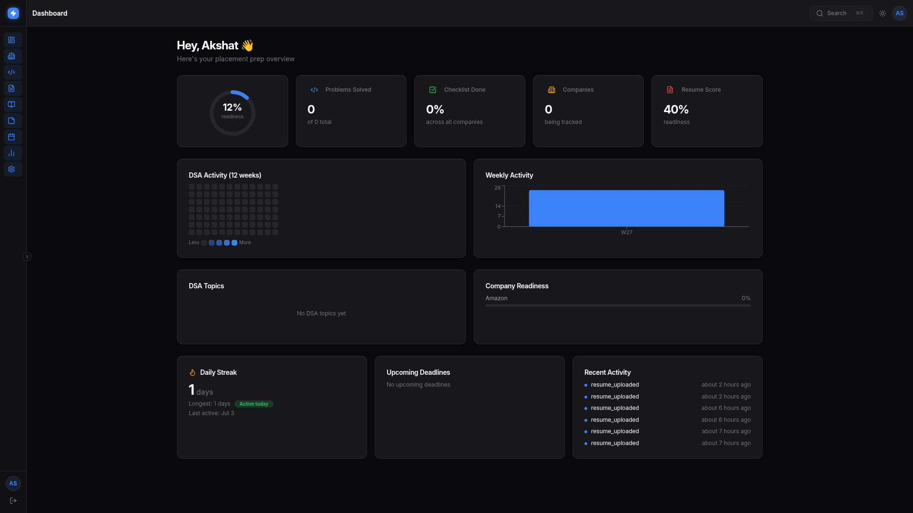
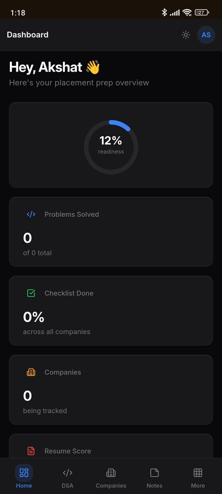
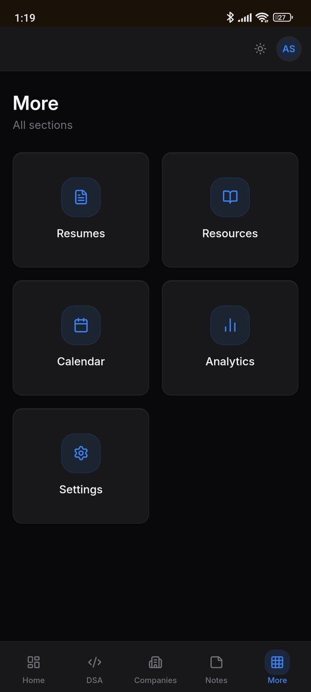

# OfferForge

A professional placement preparation hub — DSA tracking, company checklists, resume management, calendar milestones, and real-time analytics, unified in a single dashboard.

---

## Screenshots

| Desktop Dashboard |
|:-:|
|  |

| Mobile Dashboard | Mobile More |
|:-:|:-:|
|  |  |

---

## Features

- **Dashboard** — Readiness score, GitHub-style heatmap, weekly activity chart, company progress, streak tracking
- **DSA Tracker** — Problem library with filters, tags, difficulty badges, revision status, and stats
- **Companies** — Track applications, deadlines, company-specific checklists, cluster filters (FAANG, Product, etc.)
- **Resumes** — PDF upload with validation, keyword extraction, scoring, active-resume management
- **Calendar** — Milestone and deadline overview
- **Analytics** — Cross-section breakdowns and trends
- **Notes & Resources** — Personal notes and link collections
- **Settings** — Profile and preferences
- **Command Palette** — Press `⌘K` / `Ctrl+K` to search across companies, problems, notes, and resources instantly

---

## Tech Stack

| Layer | Technology |
| :--- | :--- |
| **Frontend** | React 19, TypeScript, Vite, TailwindCSS v4, Recharts, TanStack Query, Lucide Icons |
| **Backend** | Node.js 20, Express.js, JavaScript (ES Modules) |
| **Database** | MongoDB 7 + Mongoose 8 |
| **Auth** | JWT (access + httpOnly refresh cookie) + Passport Google OAuth 2.0 |
| **Storage** | Cloudinary (resume PDFs) — local binary fallback for dev |
| **Deployment** | Render (backend) + Vercel (frontend) + MongoDB Atlas |

---

## Quickstart (Local)

```bash
# 1. Clone
git clone git@github.com:AkshatSinghNayal/placement-tracker.git
cd placement-tracker

# 2. Configure environment
cp backend/.env.example .env
# Edit .env — only JWT_SECRET is required for local dev

# 3. Launch everything (MongoDB + backend + frontend)
docker compose up --build
```

| Service | URL |
| :--- | :--- |
| Frontend | http://localhost:5173 |
| Backend API | http://localhost:8000 |
| Health check | http://localhost:8000/api/v1/health |
| MongoDB | mongodb://localhost:27017 |

> No Docker? Run manually:
> ```bash
> # Terminal 1 — backend
> cd backend && npm install && node src/server.js
>
> # Terminal 2 — frontend
> cd frontend && npm install && npm run dev
> ```
> Requires MongoDB running locally on port 27017.

---

## Project Structure

```
placement-tracker/
├── backend/
│   ├── src/
│   │   ├── config/        # db.js, env.js
│   │   ├── constants/     # enums.js, checklist.js
│   │   ├── controllers/   # auth, companies, dsa, notes, resumes, …
│   │   ├── middleware/     # auth, upload, errorHandler, asyncHandler
│   │   ├── models/        # 14 Mongoose models
│   │   ├── routes/        # 10 route groups under /api/v1
│   │   ├── seed/          # seed.js — 25 catalog companies
│   │   ├── services/      # jwt, passport, cloudinary, scoring, …
│   │   ├── utils/         # ApiError, transformers, pagination, …
│   │   └── server.js      # app entry point
│   ├── .env.example
│   ├── Dockerfile
│   └── package.json
├── frontend/
│   ├── src/
│   │   ├── api/           # axios client + typed API modules
│   │   ├── components/    # layout, ui, shared
│   │   ├── context/       # AuthContext, ThemeContext
│   │   ├── pages/         # Dashboard, Companies, DSA, Notes, …
│   │   └── lib/           # utils, schemas, chartTheme
│   ├── vercel.json
│   └── vite.config.ts
├── docker-compose.yml
└── render.yaml
```

---

## Environment Variables

Copy `backend/.env.example` to `.env` in the project root and fill in your values.

| Variable | Required | Notes |
|---|---|---|
| `MONGODB_URI` | Yes | Atlas URI in prod, `mongodb://mongodb:27017/placement_tracker` in Docker |
| `JWT_SECRET` | Yes | Min 32 chars in prod |
| `JWT_EXPIRES_IN` | No | Default `15m` |
| `REFRESH_TOKEN_TTL_DAYS` | No | Default `7` |
| `GOOGLE_CLIENT_ID` | OAuth only | Leave empty to disable Google login |
| `GOOGLE_CLIENT_SECRET` | OAuth only | |
| `CLOUDINARY_CLOUD_NAME` | Uploads only | Leave empty — PDFs stored in MongoDB locally |
| `CLOUDINARY_API_KEY` | Uploads only | |
| `CLOUDINARY_API_SECRET` | Uploads only | |
| `FRONTEND_URL` | Yes | Exact origin, no trailing slash — used for CORS + OAuth redirect |
| `BACKEND_URL` | Yes | Used to build Google OAuth callback URI |
| `PORT` | No | Default `8000` |

---

## Deployment

See [DEPLOYMENT.md](DEPLOYMENT.md) for full step-by-step instructions.

**Quick summary:**
1. Create a [MongoDB Atlas](https://cloud.mongodb.com) free cluster → copy the connection URI
2. Deploy backend on [Render](https://render.com) using `render.yaml` (Blueprint) → set env vars
3. Deploy frontend on [Vercel](https://vercel.com) → set `VITE_API_URL` to your Render URL
4. Update `FRONTEND_URL` on Render to your Vercel URL
5. Add the Render callback URI in Google Cloud Console

---

## License

[MIT](LICENSE)
